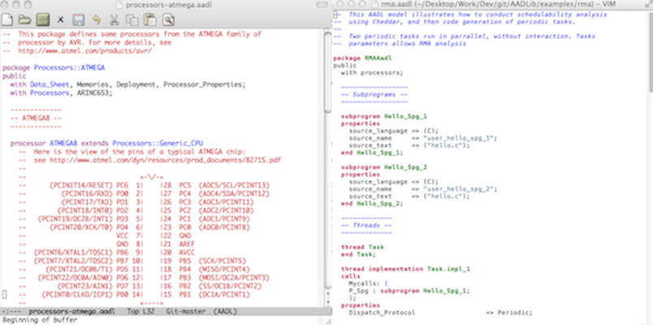

.. _editors:

==============
Editor support
==============

The AADL modes for Emacs and vim provide syntax coloration and
automatic indentation features when editing AADL files.

   AADL mode for emacs and vim

Emacs
=====

To load the AADL mode for Emacs, you need to add the following line to
your emacs configuration file (usually located in :file:`~/.emacs`) ::

      (load "/path/to/this/file.el")

For more details on this mode, please refer to the emacs contextual help.

vim
===

The AADL mode for vim is made of two files aadl.vim: one for syntactic
coloration, and the other for indentation. The file for indentation
must be placed into ~/.vim/indent/ while the one for syntactic
coloration must be placed into :file:`~/.vim/syntax/`

To load the AADL mode whenever you edit AADL files, create a file
named :file:`~/.vim/filetype.vim`, in which you write::

     augroup filetypedetect
             au BufNewFile,BufRead *.aadl    setf aadl
     augroup END

For more details, please read the documentation of vim.
