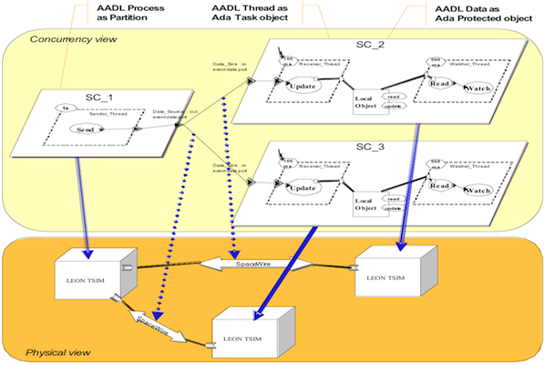

.. _introduction:

============
Introduction
============

About Ocarina
#############

.. index:: Ocarina (introduction)

Ocarina is an application that can be used to analyze and build
applications from AADL descriptions. Because of its modular
architecture, Ocarina can also be used to add AADL functions to
existing applications. Ocarina supports the AADL 1.0 and AADLv2
standards and proposes the following features :

* Parsing and pretty printing of AADL models
* Semantics checks
* Code generation, with the following code generators

  * PolyORB-HI/Ada, a High-Integrity AADL runtime and its code
    generator built on top of Ocarina that targets Ada targets: Native
    or bare board runtimes;
  * PolyORB-HI/C, a High-Integrity AADL runtime and its code generator
    built on top of Ocarina that targets C targets: POSIX systems,
    RTEMS;
  * POK, a partioned operating system compliant with the ARINC653 standard.

* Model checking using Petri nets;
* Computation of Worst-Case Execution Time using the Bound-T tool from Tidorum Ltd.;
* REAL, Requirement Enforcement and Analysis Language, an AADLv2 annex
  language to evaluate properties and metrics of AADLv2 architectural
  models;
* Scheduling analysis of AADL models, with a gateway to the Cheddar
  scheduling analysis tool from the Université de Bretagne
  Occidentale, and MAST from the University of Cantabria

Licence
#######

Ocarina is distributed under the GPLv3 plus runtime exception.

The GPLv3 plus runtime exception guarantees that Ocarina, but also the
code it generates can be distributed under customer-specific terms and
conditions. Specifically, the licence ensures that you can generate
proprietary, classified, or otherwise restricted executables.

About AADL
##########

.. index:: AADL

The “Architecture Analysis and Design Language” AADL is a textual and
graphical language for model-based engineering of embedded real-time
systems. It has been published as SAE Standard AS5506B
(http://standards.sae.org/as5506b/). AADL is used to design and
analyze the software and hardware architectures of embedded real-time
systems.

AADL allows for the description of both software and hardware parts of
a system. It focuses on the definition of clear block interfaces, and
separates the implementations from these interfaces. It can be
expressed using both a graphical and a textual syntax. From the
description of these blocks, one can build an assembly of blocks that
represent the full system. To take into account the multiple ways to
connect components, the AADL defines different connection patterns:
subcomponent, connection, and binding.

An AADL model can incorporate non-architectural elements: embedded or
real-time characteristics of the components (such as execution time,
memory footprint), behavioral descriptions. Hence it is possible to
use AADL as a back- bone to describe all the aspects of a system. Let
us review all these elements:

An AADL description is made of components. The AADL standard defines
software components (data, thread, thread group, subprogram, process)
and execution plat- form components (memory, bus, processor, device,
virtual processor, virtual bus) and hybrid components (system).  Each
Component category describe well identified elements of the actual
architecture, using the same vocabulary of system or software
engineering:

* Subprograms model procedures like in C or Ada.

* Threads model the active part of an application (such as POSIX
  threads). AADL threads may have multiple operational modes. Each
  mode may describe a different behavior and property values for the
  thread.

* Processes are memory spaces that contain the threads. Thread groups
  are used to create a hierarchy among threads.

* Processors model microprocessors and a minimal operating system
  (mainly a scheduler).

* Memories model hard disks, RAMs, buses model all kinds of networks,
  wires, devices model sensors, … 


* Virtual bus and Virtual processor models “virtual” hardware
  components. A virtual bus is a communication channel on top of a
  physical bus (e.g. TCP/IP over Ethernet); a virtual processor
  denotes a dedicated scheduling domain inside a processor (e.g. an
  ARINC653 partition running on a processor).

Unlike other components, Systems do not represent anything concrete;
they combine building blocks to help structure the description as a
set of nested components.

Packages add the notion of namespaces to help structuring the
models. Abstracts model partially defined components, to be refined
during the modeling process.

Component declarations have to be instantiated into subcomponents of
other components in order to model system architecture. At the
top-level, a system contains all the component instances. Most
components can have subcomponents, so that an AADL description is
hierarchical. A complete AADL description must provide a top-most
level system that will contain certain kind of components (processor,
process, bus, device, abstract and memory), thus providing the root of
the architecture tree. The architecture in itself is the instantiation
of this system, which is called the root system.

The interface of a component is called component type. It provides
features (e.g. communication ports). Components communicate one with
another by connecting their features. To a given component type
correspond zero or several implementations. Each of them describes the
internals of the components: subcomponents, connections between those
subcomponents, etc.

An implementation of a thread or a subprogram can specify call
sequences to other subprograms, thus describing the execution flows in
the architecture. Since there can be different implementations of a
given component type, it is possible to select the actual components
to put into the architecture, without having to change the other
components, thus providing a convenient approach to configure
applications.

The AADL defines the notion of properties that can be attached to most
elements (components, connections, features, etc.). Properties are
typed attributes that specify constraints or characteristics that
apply to the elements of the architecture: clock frequency of a
processor, execution time of a thread, bandwidth of a bus, . . . Some
standard properties are defined, e.g. for timing aspects; but it is
possible to define new properties for different analysis (e.g. to
define particular security policies).

AADL is a language, with different representations. A textual
representation provides a comprehensive view of all details of a
system, and graphical if one want to hide some details, and allow for
a quick navigation in multiple dimensions. In the following, we
illustrate both notations. Let us note that AADL can also be expressed
as a UML model following the MARTE profile.

The concepts behind AADL are those typical to the construction of
embedded systems, following a component- based approach: blocks with
clear interfaces and properties are defined, and compose to form the
complete system. Besides, the language is defined by a companion
standard document that documents legality rules for component
assemblies, its static and execution semantics.

The following figure illustrates a complete space system, used as a
demonstrator during the ASSERT project. It illustrates how software
and hardware concerns can be separately developed and then combined in
a complete model.

   ASSERT MPC Case study
