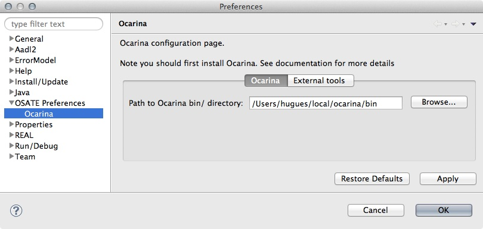
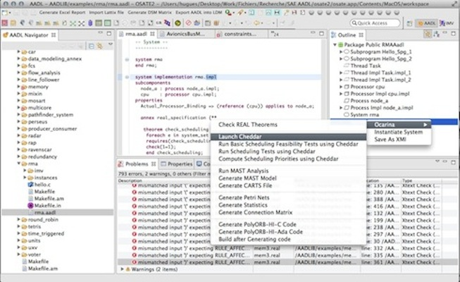

.. _osate:

======================
OSATE2-Ocarina plug-in
======================

.. index:: OSATE
.. index:: Ocarina plug-in

The OSATE2-Ocarina plugin brings all Ocarina's features to OSATE2:
code generation, generation of Petri nets, mapping of AADL models to
scheduling analysis tools, and constraint analysis using REAL.

Installation
############

An eclipse update site is available at:
https://raw.github.com/yoogx/osate2-ocarina/master/org.osate.ocarina.update/

To install the plug-in, select "Install New Software", add the install
site and then select the OSATE-OCARINA plug-in in the droplist.

Configuration
#############

The plugin can be configured from the OSATE2 Preferences panel. The
plug-in preferences are located under OSATE Preferences/Ocarina.

.. note: The plugin requires an external installation of
  Ocarina. Simply pass the full path to Ocarina `/bin` directory.

   OSATE Ocarina preferences

Usage
#####

Right-click a system implementation in the Outline, then select
Ocarina, and then the command to execute.

The output of the command (generated source code, etc.) is stored in
the `ocarina_out` folder in your project.

   OSATE Ocarina usage
